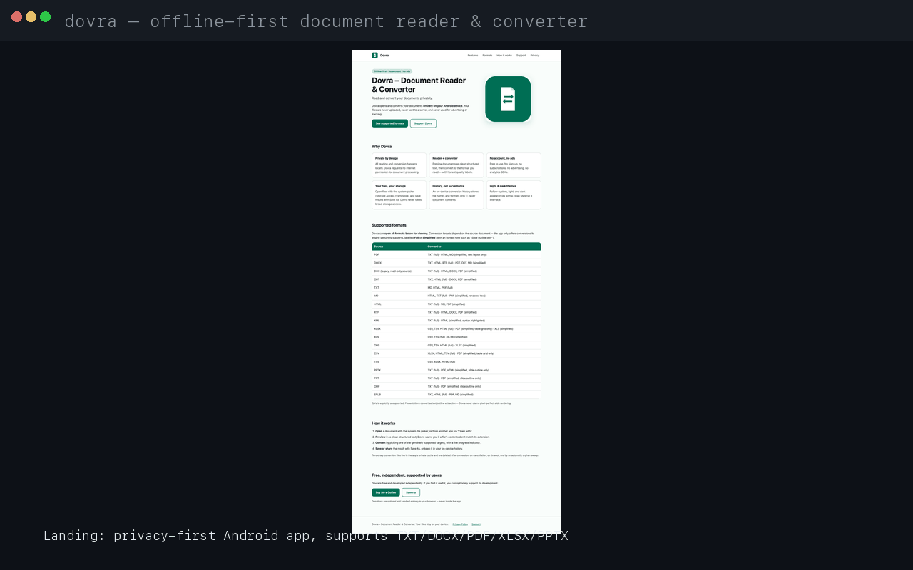

# Dovra – Document Reader & Converter

Offline-first Android document reader and converter (APK/AAB for Google Play).
Tagline: *Read and convert your documents privately.*
**All reading and conversion runs locally on device — no uploads, no cloud APIs,
no account, no ads, no analytics, no `INTERNET` permission.**

- Language: Kotlin · UI: Jetpack Compose + Material 3 · Architecture: MVVM/Clean + Repository
- Async: Coroutines/Flow · File access: Storage Access Framework (SAF) only · Persistence: Room + DataStore
- `minSdk 26` · `targetSdk 36` · `compileSdk 36` (Play 2026 compliant)
- Build: AGP 8.13.2 · Kotlin 2.1.21 · KSP 2.1.21-2.0.1 · Gradle 8.13 wrapper · JDK 17 · Compose BOM 2024.12.01

## Supported formats

Text/markup: TXT, MD, HTML, XML, RTF · Word: DOC (read-only source), DOCX, ODT ·
Spreadsheet: XLS, XLSX, ODS, CSV, TSV · Presentation: PPT, PPTX, ODP (text/outline extraction) ·
Fixed/ebook: PDF, EPUB. **DjVu is explicitly unsupported.**

## Capability matrix (single source of truth)

`app/src/main/java/com/docuconvert/app/domain/DocumentCapability.kt` (`CapabilityMatrix`)
is the contract the UI and the engine registry both obey:
UI builds its "Convert to" list **only** from `supportedTargets()`, and
`ConversionOrchestrator` must provide an engine for every FULL/SIMPLIFIED pair
(enforced by `ConversionRoutingTest`). Anything unlisted is NOT_SUPPORTED and
never gets a Convert button. SIMPLIFIED targets carry an honesty note shown in
the UI (e.g. DOCX→PDF = "Simplified layout", PPTX→PDF = "Slide outline only").

| Source → Targets |
|---|
| PDF → TXT (full), HTML/MD (simplified, text layout only) |
| DOCX → PDF (simplified layout), TXT/HTML/RTF (full), ODT/MD (simplified, basic formatting) |
| DOC (legacy, read-only) → TXT (full), HTML/DOCX/PDF (simplified, basic formatting / simplified layout) |
| ODT → TXT/HTML (full), DOCX/PDF (simplified) |
| TXT → MD/HTML/PDF (full) · MD → HTML/TXT (full), PDF (simplified, rendered text) |
| HTML → TXT (full), MD/PDF (simplified) · RTF → TXT (full), HTML/DOCX/PDF (simplified) |
| XML → TXT (full), HTML (simplified, syntax highlighted) |
| XLSX → CSV/TSV/HTML (full), PDF (simplified, table grid only), XLS (simplified, basic formatting) |
| XLS → CSV/TSV (full), XLSX (simplified, basic formatting) |
| ODS → CSV/TSV/HTML (full), XLSX (simplified) · CSV → XLSX/HTML/TSV (full), PDF (simplified, table grid only) |
| TSV → CSV/XLSX/HTML (full) |
| PPTX → TXT (full), PDF/HTML (simplified, slide outline only) |
| PPT → TXT (full), PDF (simplified, slide outline only) · ODP → TXT (full), PDF (simplified, slide outline only) |
| EPUB → TXT/HTML (full), PDF/MD (simplified) |

XLS output is genuine legacy BIFF via POI HSSF (65,536 × 256 cell caps enforced),
not mislabelled OOXML.

## How conversion works

`ConversionEngineRegistry` → `ReaderWriterEngine`: reader → `DocumentContent`
model (blocks: Heading, Paragraph, ListItem, Table, ImagePlaceholder, PageBreak)
→ writer, with progress (0–50% read, 50–100% write), 2-minute timeout, and
cancellation. Typed errors (`UnsupportedConversion`, `CorruptedFile`,
`InsufficientStorage`, `PermissionDenied`, `Timeout`, `Cancelled`, `EngineFailure`)
map to user-facing messages. Temp files live in app-private `cacheDir/temp/`
(`TemporaryFileManager`) and are cleaned on start/trim/explicit delete.
History stores **metadata only** (names, formats, sizes, timestamps) — never file bytes.

## Privacy & permissions

SAF pickers for input (`OpenDocument`) and output (`ACTION_CREATE_DOCUMENT` Save As);
`FileProvider` for share/open; persistable URI permissions. No
`READ/WRITE_EXTERNAL_STORAGE`, no `MANAGE_EXTERNAL_STORAGE`, no analytics on content —
only local settings/history (covered by backup rules). "Save As…" copies the finished
result into the user-chosen SAF destination (`exportResultToUri`).

## Build / run / release

Prereqs: JDK 17, Android SDK (compileSdk 36), Gradle wrapper in repo.

```bash
./gradlew :app:compileDebugKotlin          # compile check
./gradlew :app:testDebugUnitTest           # JVM unit tests
./gradlew :app:assembleDebug               # debug APK → app/build/outputs/apk/debug/
./gradlew :app:bundleRelease               # release AAB → app/build/outputs/bundle/release/
```

Verified artifacts: `app-release.aab` (~20 MB), `app-debug.apk` (~37 MB).
Signing config is intentionally omitted — supply via `local.properties` / CI
(never commit keystores or passwords; see `.gitignore`).

## Privacy

Full policy text: [`docs/privacy-policy.md`](docs/privacy-policy.md) (mirrored
on the website at `website/privacy/`). The in-app Privacy Policy link is
currently pointed at an unconfirmed URL — see
[`docs/privacy-policy-release-blocker.md`](docs/privacy-policy-release-blocker.md):
publish the policy at a developer-controlled public URL, then update the app
URL and the Play Console listing to match before submission.

## Store listing & release

- Finalized copy: [`docs/google-play/`](docs/google-play/) (app name, short +
  full descriptions in EN + ID).
- Data Safety evidence: [`docs/google-play-data-safety.md`](docs/google-play-data-safety.md).
- Still-needed uploads (screenshots, icon, feature graphic):
  [`docs/google-play-assets.md`](docs/google-play-assets.md)
  (ready-made 512px icon + 1024×500 feature graphic in `website/assets/`).
- Step-by-step external tasks:
  [`docs/google-play-release-checklist.md`](docs/google-play-release-checklist.md).
- Static website (GitHub Pages-ready): [`website/`](website/)
  (deploy with [`website/DEPLOYMENT.md`](website/DEPLOYMENT.md)).
R8 ships with rules for POI/ODFDOM/PDFBox/epublib plus `dontwarn` for
transitive compile-only annotations (see `missing_rules.txt` note in proguard file);
epublib's unused `kxml2` transitive dep is excluded (epublib parses OPF/NCX via the
framework `DocumentBuilder`).

## Limitations (honest)

- PDF/DOCX/PPTX outputs are simplified renderings (text layout / slide outlines) —
  complex formatting, embedded images, charts, and tracked changes are dropped.
- Legacy DOC/XLS/PPT are read-only sources; only XLS is also a (simplified) target.
- RTF parsing is a minimal local parser (bold/italic/paragraphs, `\uN`/`\'hh` decodes);
  objects/pictures become placeholders.
- Large files can hit the 2-minute conversion timeout or memory limits on low-end devices.

## Contributors

Thanks to everyone who builds with this project! 🙏

<a href="https://github.com/irwanformal-cmd">
  
</a>

**[@irwanformal-cmd](https://github.com/irwanformal-cmd)** — creator & maintainer

---

## Demo



## License table (shipped deps — no GPL/AGPL)

| Library | Version | License |
|---|---|---|
| AndroidX Core/Lifecycle/Activity/AppCompat, Compose BOM + Material 3, Navigation, Room, DataStore | see `app/build.gradle.kts` / Licenses screen | Apache-2.0 |
| Kotlinx Coroutines / Serialization JSON | 1.10.1 / 1.7.3 | Apache-2.0 |
| Apache POI (poi, poi-ooxml, poi-scratchpad) | 5.5.1 | Apache-2.0 |
| Apache Commons CSV | 1.14.1 | Apache-2.0 |
| ODFDOM Java | 0.9.0 | Apache-2.0 |
| PDFBox-Android (TomRoush fork) | 2.0.27.0 | Apache-2.0 |
| rtfparserkit | 1.16.0 | Apache-2.0 |
| epublib-core (positiondev fork) | 3.1 | LGPL-2.1 (library use, unmodified) |
| CommonMark Java (+ GFM tables) | 0.30.0 | BSD-2-Clause |
| Jsoup | 1.23.2 | MIT |
| Coil Compose | 2.7.0 | Apache-2.0 |

In-app attributions: Settings → Open Source Licenses (`LicensesScreen.kt` — keep in sync
with `app/build.gradle.kts`).
